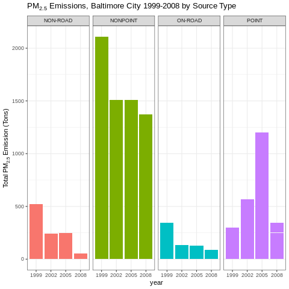
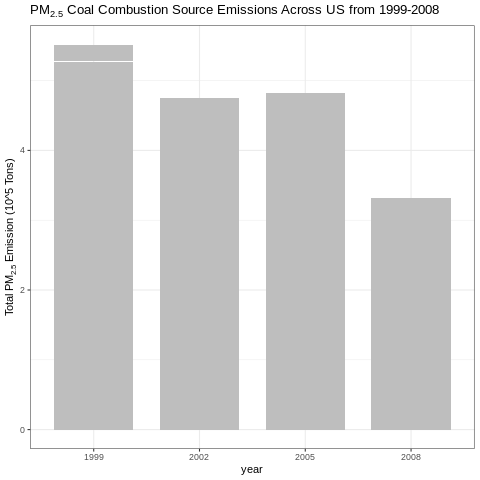
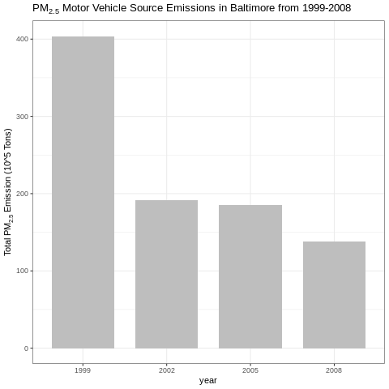
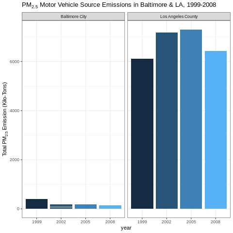

# Exploratory Data Analysis - Course Project 2

**Please note that the solutions to the questions are provided at the end of this document.**

## Introduction

Fine particulate matter (PM2.5) is a harmful air pollutant, and the Environmental Protection Agency (EPA) in the United States monitors and regulates its emissions. The EPA releases the National Emissions Inventory (NEI) every few years, which records PM2.5 emissions from various sources. This analysis focuses on data from the years 1999, 2002, 2005, and 2008.

## Data

You can access the data for this project as a zip file from the course website:

[Data for Peer Assessment [29Mb]](https://d396qusza40orc.cloudfront.net/exdata%2Fdata%2FNEI_data.zip)

The zip file contains two files:

1. `summarySCC_PM25.rds`: This file includes PM2.5 emissions data for different source types and years.

2. `Source_Classification_Code.rds`: This table maps source classification codes to their descriptions.

You can load these files into R using the `readRDS()` function.

## Assignment

The goal of this assignment is to explore the NEI database and analyze PM2.5 pollution in the United States from 1999 to 2008. You are free to use any R package for your analysis.

## Making and Submitting Plots

For each question, you should:

- Create a plot and save it as a PNG file.
- Write separate R code files (e.g., plot1.R, plot2.R) to generate the corresponding plots.
- Upload the PNG files to the assignment submission page.
- Copy and paste the R code from each R file into the peer assessment text box.

To start, ensure that the data archive is downloaded and extracted, and load the NEI and SCC data frames.

## Questions

### Question 1

Aggregate total PM2.5 emissions for each year (1999, 2002, 2005, 2008) and create a bar plot to visualize the changes.

### Question 2

Aggregate total PM2.5 emissions for Baltimore City, Maryland (fips="24510") from 1999 to 2008 and create a bar plot.

### Question 3

Use the ggplot2 plotting system to explore PM2.5 emissions in Baltimore City (1999-2008) by source type.

### Question 4

Subset the data for coal combustion-related sources and create a bar plot to examine PM2.5 emissions from these sources across the U.S. from 1999 to 2008.

### Question 5

Subset the data for motor vehicle sources and create a bar plot to analyze PM2.5 emissions from these sources in Baltimore City (1999-2008).

### Question 6

Compare PM2.5 emissions from motor vehicle sources in Baltimore City and Los Angeles County, California, and visualize the changes over time.

*Note: Detailed solutions to the questions are provided within the respective R code files.*
